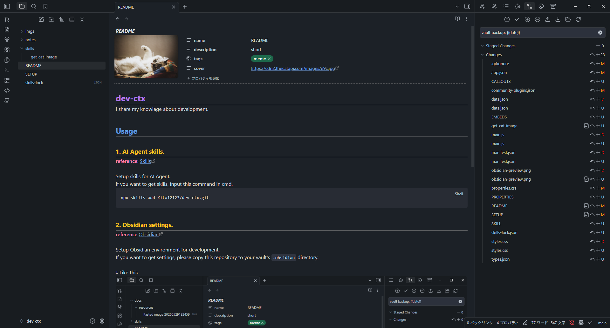

# dev-ctx
I share my knowlage about development.

## Usage

### 1. AI Agent skills.
**reference**: [Skills](https://github.com/vercel-labs/skills)

Setup skills for AI Agent.
If you want to get skills, input this command in cmd.
```shell
npx skills add Kita12123/dev-ctx.git
```

### 2. Obsidian settings.
**reference** [Obsidian](https://docs.obsidian.md/Home)

Setup Obsidian environment for development.
If you want to get settings, please copy this repository to your vault's `.obsidian` directory.

↓ Like this.
