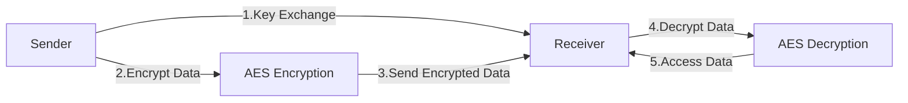
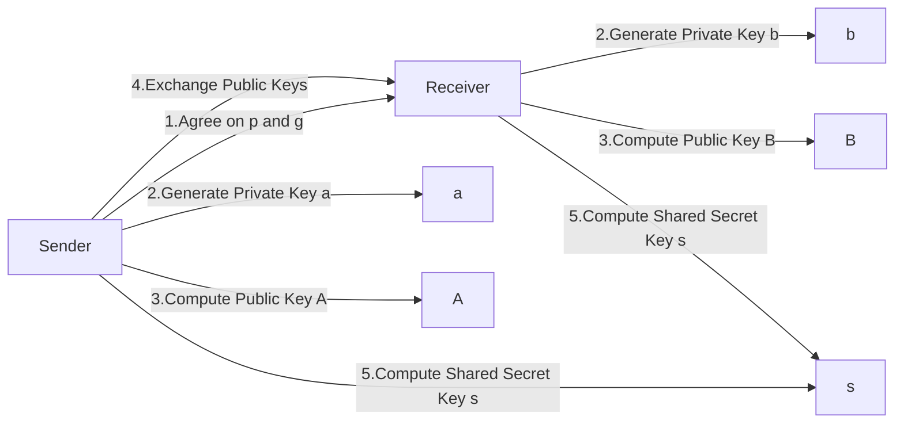

# AES Encryption

## When to use
- To encrypt data for secure communication.
- To communicate securely between parties in a network.

## What is "AES Encryption"?
AES (Advanced Encryption Standard) is a symmetric encryption algorithm that is widely used for secure communication.
It uses a secret key to encrypt and decrypt data, ensuring that only parties with the correct key can access the information.

## How to work
AES encryption works with sender and receiver who share a secret key.
To create the secret key, the sender and receiver can use a key exchange algorithm (such as Diffie-Hellman) to securely exchange the key over an insecure channel.
Once the secret key is established, the sender can encrypt the data using AES encryption and send it to the receiver.
The receiver can then decrypt the data using the same secret key.

### Diffie Hellman Key Exchange
Diffie-Hellman key exchange is a method of securely exchanging cryptographic keys over a public channel.
It allows two parties to establish a shared secret key without having to exchange the key itself.
The process of Diffie-Hellman key exchange can be summarized as follows:
1. Both parties agree on a large prime number (p) and a base (g).
2. Each party generates a private key (a and b) and computes their public key (A and B) using the formula: `A = g^a mod p` and `B = g^b mod p`.
3. The parties exchange their public keys (A and B).
4. Each party computes the shared secret key (s) using the formula: `s = B^a mod p` for the sender and `s = A^b mod p` for the receiver.
5. Both parties now have the same shared secret key (s) that can be used for AES encryption and decryption.

>[!NOTE]
>If someone intercepts the public keys (A and B) and the prime number (p) and base (g), they cannot compute the shared secret key (s) without knowing the private keys (a and b), making the communication secure.