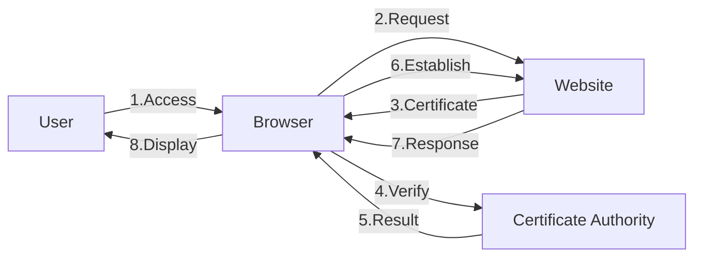
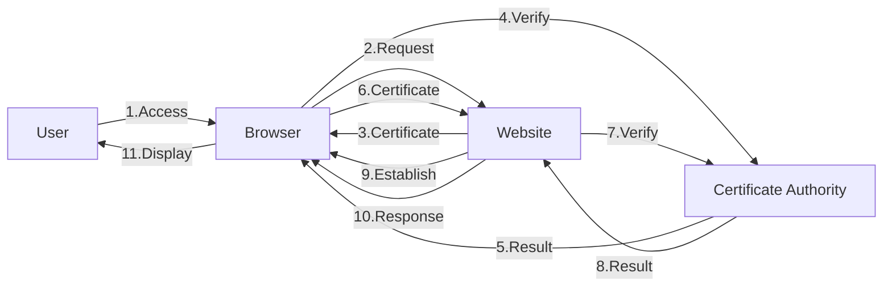

# Certificate Authority

## When to use
- To manage certificates for secure communication.
- To establish trust between parties in a network.

## What is "Certificate Authority"?
A Certificate Authority (CA) is an entity that issues digital certificates.
These certificates are used to verify the identity of entities (such as websites, organizations, or individuals) and to establish secure communication channels.

## Usage: TLS
In the context of TLS (Transport Layer Security), a CA issues certificates to websites to enable HTTPS.
When a user visits a website, their browser checks the certificate against a list of trusted CAs.
If the certificate is valid and issued by a trusted CA, the browser establishes a secure connection with the website.

The process of how a CA works in TLS can be summarized as follows:
1. The client (browser) accesses a server (website).
2. The server sends its certificate (public key, identity information, random nonce) to the client.
3. The client verifies the certificate with the CA.
4. If the certificate is valid, the client establishes a secure connection with the server ([AES encryption](./aes-encryption.md)).
5. The server sends a response to the client.
6. The client displays the content to the user.

## Usage: mTLS
In the context of mTLS (mutual TLS), both the client and server authenticate each other using certificates issued by a CA.

The process of how a CA works in mTLS can be summarized as follows:
1. The client (browser) accesses a server (website).
2. The server sends its certificate (public key, identity information, random nonce) to the client.
3. The client verifies the server's certificate with the CA.
4. If the server's certificate is valid, the client sends its own certificate to the server.
5. The server verifies the client's certificate with the CA.
6. If the client's certificate is valid, the server establishes a secure connection with the client ([AES encryption](./aes-encryption.md)).
7. The server sends a response to the client.
8. The client displays the content to the user.

## Glossary
| Term | Alias | 日本語名 | Description |
| --- | --- | --- | --- |
| `Certificate Authority` | CA | 認証局 | An entity that issues digital certificates to verify the identity of entities and establish secure communication channels. |
| `Transport Layer Security` | TLS | SSL認証, TLS認証 | A protocol that provides secure communication with servers. |
| `mutual Transport Layer Security` | mTLS | 相互SSL認証, 相互TLS認証 | A protocol that provides mutual authentication between a client and a server using certificates issued by a CA. |